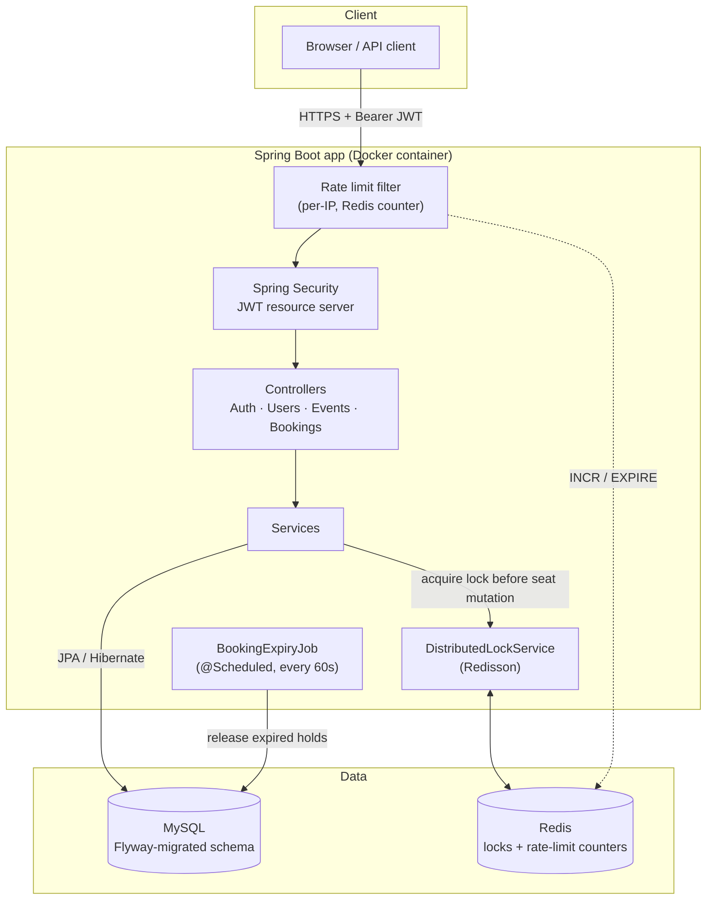

# Evently — Event Booking Platform

A production-shaped event booking API: JWT auth, role-based access, MySQL persistence with
Flyway-versioned schema migrations, and Redis-backed distributed locking that prevents
overselling seats under concurrent load. Containerized with Docker and deployed on Railway.

**Live demo:** https://eventbooking-production-e86a.up.railway.app
**API docs:** [API_DOCUMENTATION.md](./API_DOCUMENTATION.md)

---

## Why this project

Booking systems look simple until two people try to buy the last seat at the same millisecond.
This project is built around that problem: correctness under concurrency, not just CRUD.

- **Seat overselling is prevented with a real distributed lock** (Redisson, not a database
  `SELECT ... FOR UPDATE` alone), so the app can scale to multiple instances without racing.
- **Pending bookings expire automatically** — a scheduled job releases seats held by users who
  never completed payment, modeling the hold/confirm flow real ticketing platforms use.
- **Schema changes are version-controlled**, not `ddl-auto: update` — Flyway migrations are the
  single source of truth for the database, matching how teams actually manage schema in production.
- **Auth abuse is rate-limited at the filter level**, before Spring Security or the database get
  involved, so brute-force login attempts and signup spam are rejected cheaply.

## Architecture



**Request flow for a booking:** the rate-limit filter checks first (cheapest rejection point) →
Spring Security validates the JWT → the controller delegates to `BookingService` → the service
acquires a per-event Redis lock via `DistributedLockService` before touching seat counts, so two
concurrent requests for the same event can't both read-then-write stale availability → the
transaction commits, and the lock releases.

## Tech stack

| Layer | Choice |
|---|---|
| Language / runtime | Java 21, Spring Boot 4.1 |
| Web | Spring MVC (`spring-boot-starter-webmvc`) |
| Auth | Spring Security + OAuth2 Resource Server (JWT, HMAC-signed) |
| Persistence | MySQL 8, Spring Data JPA / Hibernate |
| Schema migrations | Flyway |
| Caching / locking | Redis + Redisson (distributed locks, rate-limit counters) |
| Build | Maven |
| Containerization | Docker (multi-stage build), Docker Compose for local dev |
| Deployment | Railway (Docker-based, managed MySQL + Redis) |
| CI | GitHub Actions (see `.github/workflows`) |

## Key features

- **Auth:** registration, JWT login, role-based access (`USER` / `ADMIN`) via method-level
  `@PreAuthorize` and URL-level Spring Security rules
- **Events:** admin-managed CRUD, public search with filtering (by status, minimum seats,
  free-text) and pagination/sorting
- **Bookings:** create → confirm → cancel lifecycle, with a 5-minute pending hold that
  auto-expires and releases seats back to the pool
- **Concurrency safety:** Redisson distributed lock per event ID during seat mutations,
  plus optimistic locking (`@Version`) on the `Event` entity as a second line of defense
- **Rate limiting:** per-IP fixed-window limiter (Redis `INCR`/`EXPIRE`) on `/api/auth/login`
  and `POST /api/users`, rejecting abuse before authentication or database work happens
- **Admin bootstrap:** an `ADMIN` account is provisioned automatically from environment
  variables on first startup — no manual SQL required to get an admin login

## Running locally

### Option 1 — Docker Compose (recommended)

```bash
cp .env.example .env
# edit .env with your own values — see the file for what's required
docker compose up -d --build
```

Then open `http://localhost:8080`. Health check: `GET /actuator/health`.

### Option 2 — Maven, against your own MySQL/Redis

```bash
$env:DB_URL = "jdbc:mysql://localhost:3306/event_booking?createDatabaseIfNotExist=true"
$env:DB_USERNAME = "root"
$env:DB_PASSWORD = "your-password"
$env:ADMIN_EMAIL = "admin@example.com"
$env:ADMIN_PASSWORD = "change-this-password"
$env:JWT_SECRET = "replace-with-a-long-random-secret-at-least-32-characters"
.\mvnw.cmd spring-boot:run
```

Flyway creates the schema automatically on startup — no manual migration step needed.

## Running the tests

```bash
./mvnw test
```

Includes a concurrency test (`BookingConcurrencyTest`) that fires simultaneous booking requests
at a limited-seat event to verify the distributed lock actually prevents overselling — the test
that matters most in this codebase.

## Deployment

Deployed on Railway from this repo's `Dockerfile`, with managed MySQL and Redis plugins.
Environment variables are wired through Railway's variable-reference system
(`${{ServiceName.VAR}}`) so database/cache credentials are never hardcoded. See
[`RAILWAY_DEPLOY.md`](./RAILWAY_DEPLOY.md) for the exact setup steps.

## Project structure

```
src/main/java/com/eventbooking/
├── config/       # Security, rate limiting, admin bootstrap
├── controller/   # REST endpoints
├── dto/          # Request/response shapes, decoupled from entities
├── entity/       # JPA entities
├── exception/    # Domain exceptions + centralized handler
├── job/          # Scheduled booking-expiry cleanup
├── repository/   # Spring Data JPA repositories
└── service/      # Business logic, including the distributed locking service
src/main/resources/db/migration/   # Flyway-versioned schema
```

## License

MIT — see [LICENSE](./LICENSE).